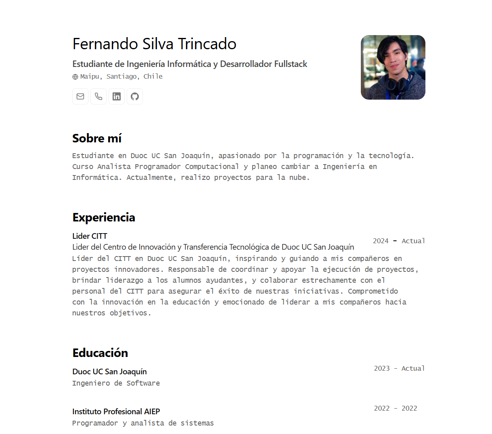

# Portfolio Minimalista basado en Astro y adaptado para AWS

Este proyecto se basa en el [Minimalist Portfolio JSON](https://github.com/midudev/minimalist-portfolio-json) con adaptaciones para subirlo a la nube de AWS y ajustes menores.

Originalmente diseñado por [Bartosz Jarocki](https://github.com/BartoszJarocki/cv).




## 🛠️ Stack

- **[Astro](https://astro.build/)** - El framework web de la nueva era.
- **[Typescript](https://www.typescriptlang.org/)** - JavaScript con tipado estático.
- **[Mi Guia](https://dev.to/fernandosilvot/guia-completa-para-crear-una-web-estatica-con-aws-s3-y-aws-cli-c2j)** - Guía completa para desplegar en AWS S3.
- **[AWS S3](https://aws.amazon.com/s3/)** - Almacenamiento de archivos estáticos.
- **[AWS CloudFront](https://aws.amazon.com/cloudfront/)** - Distribución de contenido.
- **[AWS Amplify](https://docs.aws.amazon.com/amplify/latest/userguide/welcome.html)** - Gestión de despliegue y backend.

## 🚀 Empezar

### 1. Usa este [repo](https://github.com/fernandosilvot/minimalist-porfolio-json) como _template_ para tu proyecto de Astro

### 2. Personaliza el contenido

Edita el archivo `cv.json` para crear tu propio portafolio/CV imprimible.

### 3. Configura AWS S3

Para configurar el despliegue en AWS S3, sigue estos pasos:

1. **Configura AWS CLI**: Asegúrate de tener AWS CLI instalado y configurado con las credenciales adecuadas. Puedes seguir la [guía de configuración de AWS CLI](https://docs.aws.amazon.com/cli/latest/userguide/cli-configure-quickstart.html).

2. **Crea un bucket S3**:
   - Inicia sesión en el [panel de AWS S3](https://s3.console.aws.amazon.com/s3/home).
   - Crea un nuevo bucket con el nombre que prefieras.
   - Configura los permisos y políticas del bucket según tus necesidades.

3. **Configura el script de despliegue**:
   - Asegúrate de que el archivo `package.json` en la raíz del proyecto contenga el siguiente script de despliegue:

    ```json
    "scripts": {
      "deploy": "pnpm run build && aws s3 sync ./dist s3://nombre_del_bucket"
    }
    ```
   - Asegurate de cambiar `nombre_del_bucket` al nombre de tu bucket 
   - Este script construye el proyecto y sincroniza los archivos del directorio `./dist` con el bucket S3.

4. **Despliega el proyecto**:

    Ejecuta el siguiente comando para construir el proyecto y sincronizar los archivos con el bucket S3:

    ```bash
    pnpm run deploy
    ```

   - Este comando ejecutará el script de despliegue y subirá los archivos a tu bucket S3.

5. **Configura AWS CloudFront (opcional)**: Para mejorar la distribución del contenido, configura AWS CloudFront para distribuir el contenido estático del bucket S3.

6. **Configura AWS Amplify (opcional)**: Usa AWS Amplify para gestionar el despliegue y backend si lo necesitas.

Consulta la [documentación de AWS Amplify](https://docs.aws.amazon.com/amplify/latest/userguide/welcome.html) para obtener detalles adicionales.

### 4. Lanza el servidor de desarrollo

```bash
# Disfruta del resultado
pnpm dev
```

1. Abre [http://localhost:4321](http://localhost:4321/) en tu navegador para ver el resultado 🚀

## 🧞 Comandos

| Comando          | Acción                                        |
| :--------------- | :-------------------------------------------- |
| `dev` o `start`  | Lanza un servidor de desarrollo local en `localhost:4321`. |
| `build`          | Comprueba posibles errores y empaqueta la producción en `./dist/`. |
| `preview`        | Vista previa en local en `localhost:4321` |
| `deploy`         | Construye el proyecto y sincroniza los archivos con el bucket S3. |

## 🔑 Licencia

[MIT](LICENSE.txt) - Creado por [Fernando Silva](https://github.com/fernandosilvot).
`